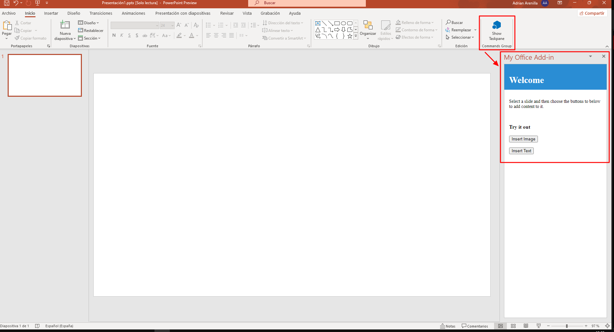
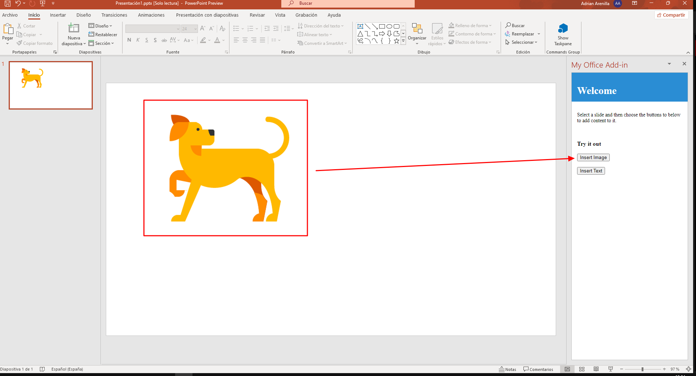
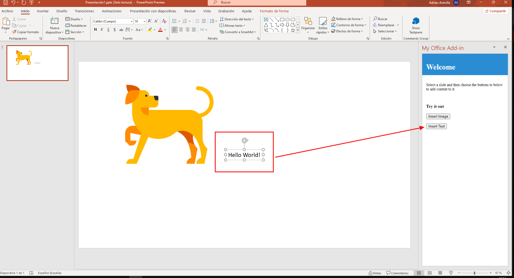

# Microsoft Ms-600 (Adrián Arenilla Seco) - LAB 05

## Exercise 3: Understanding customization of add-ins
### [Go to exercise 03 instructions -->](04-Exercise-3-Understanding-customization-of-add-ins.md)

In PowerPoint, choose the Home tab, and then choose the Show Taskpane button in the ribbon to open the add-in task pane.

Choose the Insert Image button to add an image to the selected slide.

Choose the Insert Text button to add text to the selected slide.

### [<-- Back to readme](../../../../)