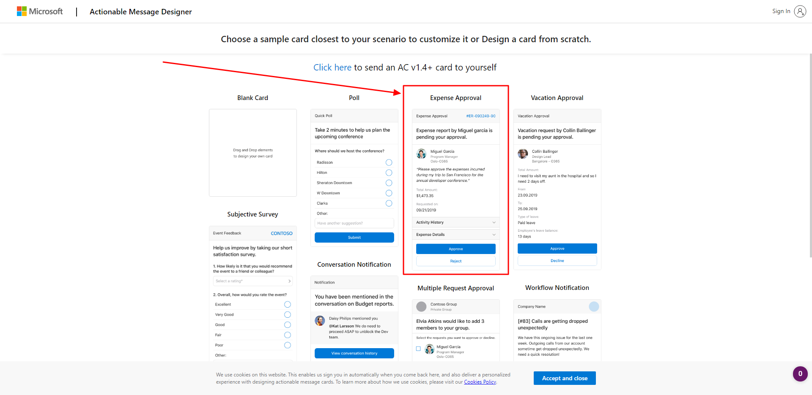
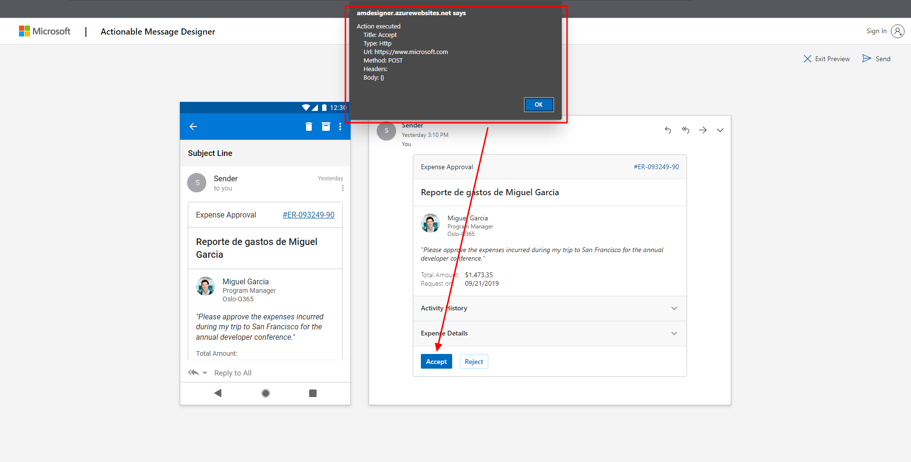
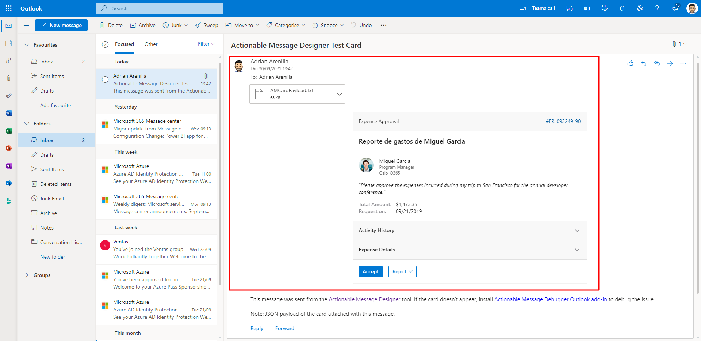
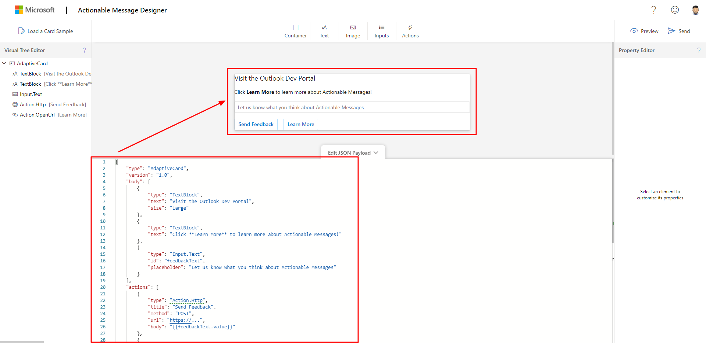
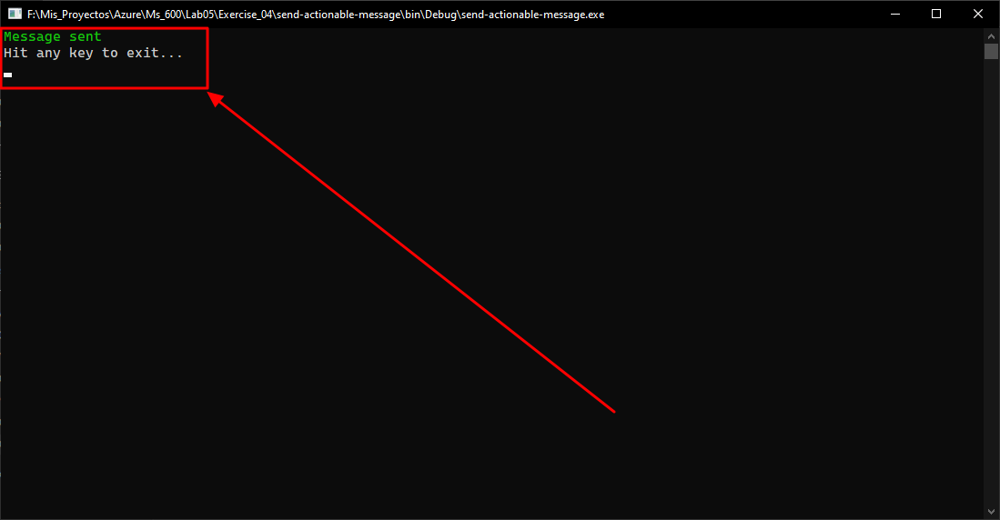
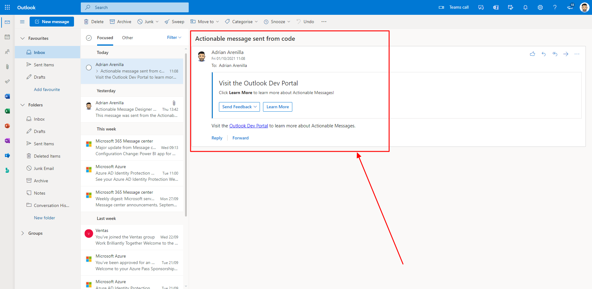

# Microsoft Ms-600 (Adrián Arenilla Seco) - LAB 05

## Exercise 4: Understanding actionable messages
### [Go to exercise 04 instructions -->](05-Exercise-4-Understanding-actionable-messages.md)

Choose a predefined design such as Expense Approval.

Test the button to see the HTTP request by selecting the Accept button.

Check email to see if the adaptive card has been sent and is displaying successfully.

Go to the Card Playground and paste in the JSON. You can see the adaptive card reference for details on the available fields.

Send the adaptive card to the desired e-mail address via Visual Studio.

Check email to see if the adaptive card has been sent and is displaying successfully.

### [<-- Back to readme](../../../../)